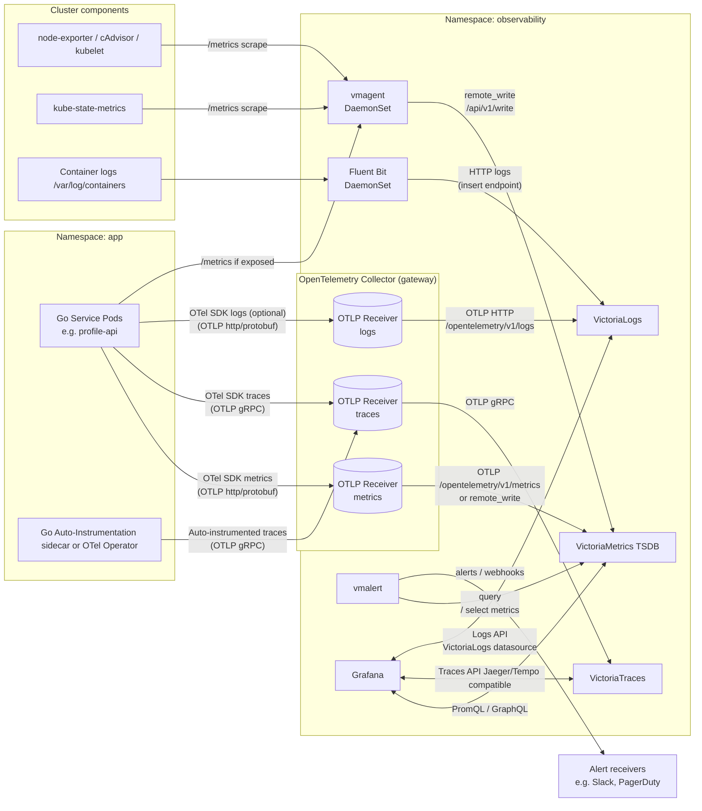

## High-level design

Very opinionated setup with specific toolings and conventions that you may or may not like.

Services in this repository will combine aspects of layered architecture, domain-driven and hexagonal (ports and adapters) to try to produce a readable and maintainable source code.

### Boundary control

golangci-lint & depguard is used to enforce import rules

### Cross-module communication

## Deployment

## Choosing between RESTful HTTP and GraphQL

## Designing RESTful HTTP APIs

https://github.com/bacen/pix-api

### Concurrency control

#### Etag Header

#### Middlewares

### OWASP

## Code Generation From OpenAPI Spec

- Specs and codegen configs live under `oapi/`:
  - `oapi/profile-api-spec.yaml`, `oapi/cfg.server.profile.yaml`
  - `oapi/payment-api-spec.yaml`, `oapi/cfg.server.payment.yaml`
- Generated server stubs and models are written to `api/`:
  - `api/profileapi/server.gen.go`
  - `api/paymentapi/server.gen.go`
- The project uses `oapi-codegen` with “std-http-server” and (for Profile) “strict-server” generation.
  - Strict handlers expose request/response objects that enforce spec shapes at compile time.
  - See `server/stdlib_server.go` for how strict handlers are wrapped and registered.
- Regeneration
  - Inline `go:generate` lines are declared in `main.go`:
    - `go tool oapi-codegen -config oapi/cfg.server.profile.yaml oapi/profile-api-spec.yaml`
    - `go tool oapi-codegen -config oapi/cfg.server.payment.yaml oapi/payment-api-spec.yaml`
  - Run `make gen` to regenerate all code (calls `go generate ./...`).
  - Run `make check` to verify generated code is up-to-date.
- Do not edit files under `api/` directly. Change the spec or config in `oapi/` and regenerate.

Validation and error mapping

- Requests are validated against the OpenAPI spec before handler logic via `ProfileHTTPValidationMiddleware` (see `profile-service/middlewares.go`).
- Errors are normalized to RFC7807 problem details (`profile-service/error_handler.go`).

## Source Code Architecture

High-level layout

- `main.go`: Composition root; config parsing, dependency wiring, and server bootstrap.
- `server/`: HTTP server setup using the Go stdlib mux, timeouts, and middleware wiring.
- `oapi/`: OpenAPI specs and `oapi-codegen` configs.
- `api/`: Generated models and server interfaces from OpenAPI.
- `profile-service/`: Domain/application logic, HTTP adapter for the Profile API, middlewares, and migrations.
- `db/`: Database interfaces and abstractions (connection pool, transactions, health, migrations).
- `db/postgres/`: PostgreSQL implementation of `db.ConnectionPool`.
- `compose.yaml`, `.env`: Local development and configuration.

Request flow

1. `server.New` assembles the HTTP mux, attaches middleware, and registers generated handlers.
2. `profile-service/middlewares.go` validates requests against the OpenAPI spec and provides panic recovery.
3. Generated code in `api/profileapi/server.gen.go` or `api/paymentapi/server.gen.go` de/serializes requests and calls your implementation.
4. Profile API implementation lives in `profile-service/api.go` and delegates to application logic in `profile-service/app.go`.
5. Application logic depends on `ProfilePersistence` (an interface) and a `db.ConnectionPool` for transactions and read/write routing.

Key adapters and boundaries

- HTTP → Domain: `profile_service.ProfileAPI` implements `profile_api.StrictServerInterface`.
- Domain → Persistence: `ProfilePersistence` is implemented by `PostgresProfilePersistence` (`profile-service/persistence.go`).
- Persistence → DB: Only uses `db.Querier` so it can work with both `*sqlx.DB` and `*sqlx.Tx`.

### Designing GraphQL APIs

## Observability

Monitoring and debugging application in a distributed system is a hard problem since there are often too many moving parts in just a single business workflow. Capturing enough data to answer questions on application performance and operational issues meaningful proves to be a challenge.

OpenTelemetry is an observability framework that standardizes the telemetry collection and integration with a multitude of tools that are Otel compatible.

### Logs, metrics & traces

The three pillars of observability are traces, metrics and logs.

### Go libraries & tooling

- Auto-instrumentation

- Modes:
  - Manual
  - Auto
  - Detect

### Tech stack in this repository

This stack represents a **"Pure Victoria" High-Performance Architecture**. It minimizes resource usage (RAM/CPU) by using single-binary tools and eBPF instead of heavy agents.

| Data Type           | Tool / Service        | Component Name     | Why is it in this stack?                                                                                                                        |
| :------------------ | :-------------------- | :----------------- | :---------------------------------------------------------------------------------------------------------------------------------------------- |
| **Database**        | **PostgreSQL**        | `postgres`         | The persistent data store. Includes replication to test production-like read/write scenarios.                                                   |
| **Instrumentation** | **OTel Auto-Inst.**   | `otel-agent`       | **Zero-Code Tracing.** Uses eBPF to attach to the Go process at runtime, generating traces without you writing manual OTel code.                |
| **Metrics**         | **Coroot Node Agent** | `node-agent`       | **Infrastructure Spy.** Replaces `node_exporter`/`cadvisor`. Uses eBPF to see container CPU/Mem and—crucially—network topology map.             |
| **Metrics**         | **VictoriaMetrics**   | `victoria-metrics` | **Metric Storage.** Replaces Prometheus. Uses ~10x less RAM and handles high cardinality better for local dev.                                  |
| **Metrics**         | **VMAgent**           | `vmagent`          | **Scraper.** The "glue" that scrapes `node-agent` and pushes data to VictoriaMetrics.                                                           |
| **Metrics**         | **VMAlert**           | `vmalert`          | **Logic Engine.** Computes derived health metrics (e.g., "SLO violation") required for the KirillYu dashboards.                                 |
| **Logs**            | **Fluent Bit**        | `fluent-bit`       | **Collector.** Lightweight log router. Captures Docker container logs and converts them to JSON for VictoriaLogs.                               |
| **Logs**            | **VictoriaLogs**      | `victoria-logs`    | **Log Storage.** Replaces Loki/Elasticsearch. Extremely low RAM usage for high-volume log storage.                                              |
| **Traces**          | **VictoriaTraces**    | `victoria-traces`  | **Trace Storage.** Replaces Tempo/Jaeger. Integrates natively with the Victoria ecosystem and shares the same design philosophy (simple, fast). |
| **Visualization**   | **Grafana**           | `grafana`          | **The UI.** Connects to VM (Metrics), VLogs (Logs), and VTraces (Traces via Jaeger API) to visualize everything in one place.                   |

#### Kubernetes deployment

- Architecture:

### AWS X-Ray ID

https://raw.githubusercontent.com/autopilot-team/interview/refs/heads/main/backends/internal/core/tracer.go

## Persistence

### OLTP and OLAP

### Choosing persistence infrastructure

### Migration

### Read replica pattern

One pattern for optimizing the response time of a database query is to separate the read and write process, from the application level down to the network level. The read replica pattern separates read and write at the instance level, meaning we read and write to different database instances, and the changes get synced eventually, thus ensuring eventual consistency.

### PostgreSQL-based implementations

Interfaces (`db/db.go`)

- `ConnectionPool` combines health, connection management, migrations, and transaction helpers.
- `ConnectionManager` exposes `Writer()` and `Reader()` for write/read paths.
- `TxManager` exposes `WithTx(ctx, fn)` and `WithTimeoutTx(ctx, timeout, fn)` to run work atomically.
- `Querier` is `sqlx.ExtContext` so both `*sqlx.DB` and `*sqlx.Tx` conform.

PostgreSQL adapter (`db/postgres/postgres.go`)

- Provides a writer `*sqlx.DB` and an optional set of readers with simple random selection for reads.
- Transaction helpers wrap `BEGIN`/`COMMIT`/`ROLLBACK` with panic safety and proper error propagation.
- `HealthCheck()` pings the database via a lightweight query.
- Migrations are intentionally stubbed for teams to plug in their tool of choice (dbmate, goose, atlas).

Application usage (`profile-service/app.go`)

- Writes run inside transactions using `pool.WithTimeoutTx`:
  - Example: `CreateProfile` starts a transaction, calls persistence, and commits or rolls back on error.
- Reads are routed to replicas by calling `pool.Reader()` from persistence methods like `GetProfilesByOffset`/`GetProfilesFirstPage`.

Persistence layer (`profile-service/persistence.go`)

- Uses plain SQL with `sqlx` and returns domain models.
- Maps Postgres constraint violations (e.g., `pgerrcode.UniqueViolation` 23505) to sentinel errors (`ErrDuplicateEntry`).
- Defers policy decisions to the application layer where domain errors are chosen and then mapped to RFC7807.

## Event sourcing

## Serverless patterns

### Lambda

## Docker image

## Local Development

Prerequisites

- Go 1.25+
- Docker + Docker Compose (for Postgres)

Setup

- Start database: `docker compose up -d database`
- Ensure environment variables (see `.env`):
  - `POSTGRES_PRIMARY_HOST`, `POSTGRES_PRIMARY_PORT`, `POSTGRES_PRIMARY_USER`, `POSTGRES_PRIMARY_PASSWORD`, `POSTGRES_PRIMARY_DATABASE`
  - Optional replicas: `POSTGRES_REPLICA_*`
  - `HMAC_SECRET`

Generate and run

- Generate code: `make gen`
- Verify generation: `make check`
- Run locally: `go run .`
- Build binaries: `go build ./...`

Lint and test

- Basic lint: `gofmt -s -w .` and `go vet ./...`
- Run tests: `go test ./...`

## Extending The Template

Add a new API surface

- Author or update the OpenAPI spec under `oapi/your-api-spec.yaml`.
- Add a matching codegen config `oapi/cfg.server.yourapi.yaml` with output to `api/yourapi/server.gen.go`.
- Implement the generated server interface in a new package (e.g., `your-service/`) following the profile service layout.
- Register the implementation in the HTTP server via a `server.WithYourApi(...)` option.
- Run `make gen` and `go run .`.

Add persistence for a new aggregate

- Define a `YourPersistence` interface in your service package using `db.Querier`.
- Implement it in `your-service/persistence.go` with SQL and sentinel error mapping.
- Use `pool.WithTx`/`WithTimeoutTx` for writes; `pool.Reader()` for read paths.
